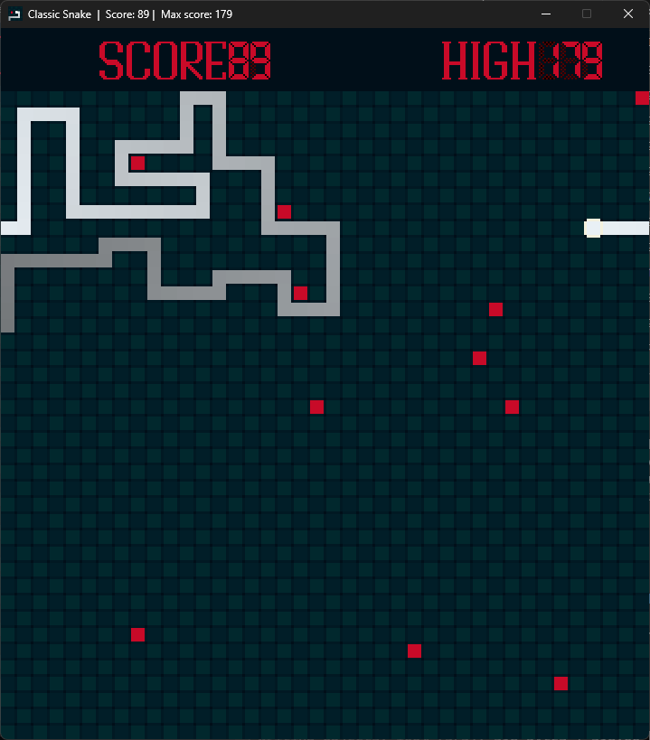
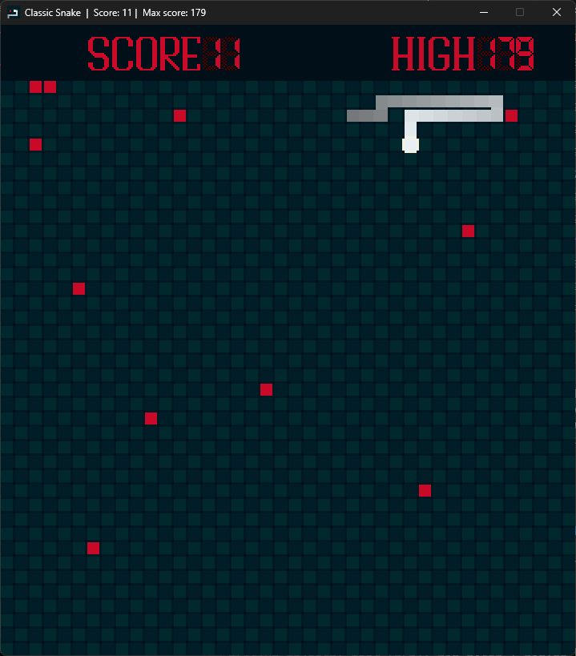

/SDL3 Snake Game/

A simple arcade style Snake game written in C using SDL3.

Screenshots

Windows may show a SmartScreen warning because the
program is not code-signed. Click "More info" → "Run anyway".

* Features

\- Grid-based snake movement

\- Food spawning

\- Score tracking

\- Keyboard controls

* Controls

Arrow Keys / WASD : Move snake

Space : Pause

Esc : Quit

* Build Instructions:

Requirements:

\- SDL3

\- GCC / Clang

Compile:

gcc main.c -lSDL3 -o snake

Run:

./snake

